## Sobre mim

Sou o Dany, tenho 34 anos e sou de São Roque - SP. Estou cursando Análise e Desenvolvimento de Sistemas na Anhembi Morumbi e me especializando como desenvolvedor backend.

Trabalho principalmente com Python e Java, construindo APIs, automatizando tarefas e explorando IA aplicada a projetos reais. Gosto de pegar um problema, entender a fundo e sair com algo funcionando — sempre aprendendo algo novo no caminho.

Esse GitHub é onde guardo meus projetos e experimentos enquanto evoluo nessa jornada. Se quiser trocar uma ideia, os contatos estão logo abaixo.

## Tecnologias & Ferramentas

#### Linguagens

#### Front-end

#### Backend & APIs

#### Banco de dados

#### Inteligência Artificial

#### Ferramentas

## Linguagens em destaque

## Ritmo de commits

<picture>
<source media="(prefers-color-scheme: dark)" srcset="https://raw.githubusercontent.com/Danyyks/Danyyks/output/github-contribution-grid-snake-dark.svg">
<source media="(prefers-color-scheme: light)" srcset="https://raw.githubusercontent.com/Danyyks/Danyyks/output/github-contribution-grid-snake.svg">

</picture>

## Contatos e redes sociais

